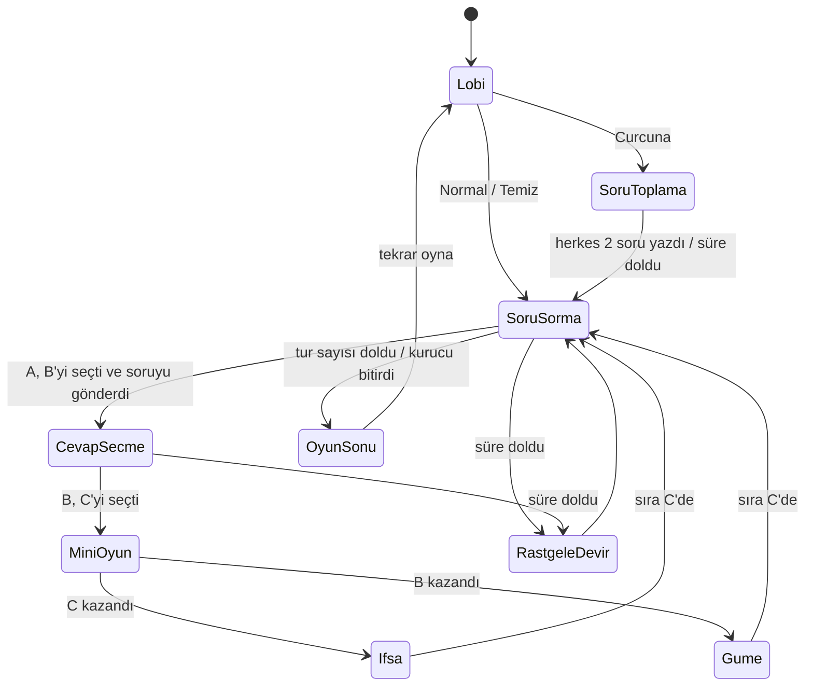

# Çakmak — Ana Plan

Yazıldı: **2026-10-02** · Kaynak: [[Brief]] · Takvim: **sprintlerde tarih yok**
Durum: kararlar **öneri**, Enes itiraz etmezse geçerli. ✅ işaretliler Enes'in 2026-10-02 cevapları.

---

## 1. Kararlar: brief'te açık kalanlar

### Tur kuralları

| Konu | Karar | Neden |
|---|---|---|
| Oyuncu sayısı | **4–10** ✅ | B, A'yı gösteremediği için 3 kişide B'nin tek seçeneği kalıyor. 10'dan fazlasında sıra gelmez |
| İlk tur | Rastgele biri başlar | |
| Ne gizli, ne açık | **Sadece soru metni gizli.** A'nın B'yi seçtiği, B'nin C'yi seçtiği, mini oyun ve sonucu herkese görünür | Gerçek oyunda da kimin kime fısıldadığı ve çakmağı kime verdiği görülür. Gerilim buradan çıkıyor |
| A kimi seçebilir | Kendisi hariç herkesi | |
| B kimi seçebilir (C) | **Kendisi ve A hariç herkesi** ✅ | A'yı gösterirse sıra hep A'ya döner |
| Soru nasıl gider | **Yazılı**, en fazla 140 karakter. Elden ele modda ek olarak **"Fısıldadım"** butonu: soru gerçekten kulağa söylenir, uygulama metni bilmez | Online'da sadece B'nin duyacağı sesli fısıltı ayrı bir ses kanalı demek. MVP için pahalı |
| Aklına soru gelmezse | Normal modda **"Öneri çek"** butonu: havuzdan rastgele bir soru yazı kutusuna gelir, düzenlenebilir | Boş bekleme olmasın |
| Mini oyun | Kurucu seçer: **TKM** (varsayılan) / Tek-Çift / Zar / Karışık (her tur rastgele) | Brief TKM diyor. Diğer ikisi de gecikmeden etkilenmiyor (bkz. 6.5) |
| Beraberlik | Tekrar. 3. beraberlikte zar atılır | Sonsuza gitmesin |
| İfşa | Soru, soranın adı ve cevap (C) herkese 6 sn büyük gösterilir. Sohbete de düşer | |
| Güme | "Soru güme gitti" yazısı. Metin kimseye gösterilmez, sunucuda da tutulmaz | |
| Sıra | Sonuç ne olursa olsun **C'ye geçer** (brief) | |
| Oyun sonu | Kurucu seçer: 10 tur / 20 tur / sınırsız (kurucu bitirir) | |
| Puan | Yok. Kazanan sadece gizli görevden çıkar (bkz. 8.2) | Oyun puan için değil, laf için oynanıyor |
| Oyun sonu ekranı | 3 unvan + görevler + paylaşım kartı (bkz. 8.6) | Oyunun sonunda gülme anı |

### Süreler ve süre dolunca

| Aşama | Süre (kurucu değiştirebilir) | Süre dolunca |
|---|---|---|
| A, B'yi seçer + soruyu yazar | 60 sn | A'nın turu yanar. Sıra rastgele birine geçer |
| B, C'yi seçer | 20 sn | Soru güme gider. Sıra rastgele birine geçer |
| Mini oyun hamlesi | 10 sn | Hamle yapmayan kaybeder. İkisi de yapmazsa B kazanır, soru gizli kalır |
| Curcuna soru toplama | 90 sn | Yazmayanın yerine havuzdan hazır soru konur |

**Süre dolması AFK'yı da çözüyor.** Kimse kimseyi beklemez.

### Modlar

| Mod | Karar |
|---|---|
| **Normal** | Serbest yazı + "Öneri çek" |
| **Temiz** ✅ | Normal gibi, ama soru ve sohbet filtreden geçer. Yakalanan mesaj **gönderilmez**, sadece yazan "gönderilmedi" görür. **3. ihlalde odadan atılır**, o odaya geri giremez. Filtre adımları 6.4'te |
| **Curcuna** | Herkes 2 soru yazar. Sorular **isimsiz** havuza girer. A'ya rastgele bir soru atanır, 1 kez "değiştir" hakkı var. Kendi sorusu da gelebilir, kimse bilmez. Havuz biterse karıştırılıp baştan alınır |

### Online

| Konu | Karar |
|---|---|
| Platformlar | **PC + Android birlikte** (crossplay). iOS sonra (Mac + yılda 99 $) |
| Oda | 5 harfli kod. Karışan harfler yok (0/O, 1/I). **Sadece kodla katılım, herkese açık oda yok** |
| Hesap | Yok. İsim + rastgele renk |
| Kurucu | Ayarları seçer, başlatır, oyuncu atabilir. Çıkarsa kuruculuk en eski oyuncuya geçer |
| Geç gelen | Oyun başladıysa bekleme odasına girer, sonraki oyunda oynar |
| Kopan | 60 sn yeri tutulur. Dönünce kaldığı yerden devam eder |
| Sohbet | Genel + DM. Mesaj 200 karakter. Saniyede en fazla 1 mesaj |
| Ses | Oda başına tek kanal. Herkesin mikrofonu açık, kendini ve başkasını susturabilir. **"Aynı odadayız" anahtarı** sesi kapatır (aynı odada yankı yapar) |

### Elden ele (tek cihaz)

| Konu | Karar |
|---|---|
| Kurulum | 4–10 isim yazılır |
| Gizlilik | Soru yazılınca **perde:** "Telefonu Ayşe'ye ver". Ayşe "Basılı tut ve oku" der. Parmak kalkınca soru kapanır |
| Mini oyun | Telefon ikisinin arasına konur. **Ekran ikiye bölünür, üst yarı ters döner** (karşılıklı oturuyorlar). TKM gibi gizli seçimlerde sırayla seçilir, arada perde |
| Ek mini oyun | **Reaksiyon** ("yeşil olunca bas") sadece burada var. Aynı cihazda adil |
| Sohbet / ses | Yok, zaten aynı odadasınız |

### Teknik ve ticari

| Konu | Karar |
|---|---|
| Motor | **Unity 6000.6.4f1** ✅ (Hub'da "supported, recommended"). İkiniz de tam bu sürüm. Gerekçe 3. bölümde |
| Repo | https://github.com/enesyilmaz19/TheLighter · yerelde `UnityProjects\TheLighter` · ortak yapay zekâ talimatı `AGENTS.md` |
| Online altyapı | **Kendi küçük C# sunucumuz.** ASP.NET Core + WebSocket, tek VPS (~5 $/ay), Caddy ile `wss://` |
| Kural kodu | Sade C#, UnityEngine yok. Elden ele modda Unity çalıştırır, online modda sunucu. **Aynı dosyalar** |
| Ses | MVP'de **Discord**. Sonra **Vivox** |
| Dil | Sadece TR. Ama metinler **ilk günden** tek tabloda (Unity Localization). EN/DE sonra |
| Mağaza | Steam (PC) + Google Play (Android) |
| Satış modeli | **S4'ten önce karar verilecek** ✅. O zamana kadar sunucu herkesi kabul eder |
| Yaş sınırı | 13+. Sohbet var ama herkese açık oda yok |
| Kim kim | **Geliştirici 1 = Enes (backend). Geliştirici 2 = arkadaş (Unity istemcisi)**. Arkadaş Unity'de daha iyi olduğu için |

---

## 2. Tur akışı



---

## 3. Platform

### Motor

| Seçenek | Artı | Eksi |
|---|---|---|
| **Unity** ✅ | Ekip biliyor. Tek projeden PC + Android build. Vivox Unity'nin kendi ürünü. Kural kodu C#, sunucu da C# | Basit bir arayüz için ağır. Android build büyük (~50 MB+). Herkes uygulamayı indirmek zorunda |
| Web (TypeScript) | **Linke tıkla, katıl.** Parti oyununda en büyük koz (Jackbox böyle). Tek kod her yerde. Sohbet ekranı HTML'de kolay | Ekip bilmiyor. Steam'de satmak için sarmalayıcı (Electron/Tauri) lazım. Kopyalanması kolay. Mobil tarayıcıda ekran kararması ve mikrofon izni dertli |
| Godot | Bedava, hafif | Ekip bilmiyor. Ses ve ağ eklentisi az |

"Linkle katıl" avantajı kaybolmuyor. Sunucu WebSocket konuşuyor, ileride tarayıcıdan katılan küçük bir web istemcisi eklenebilir.

### Online altyapı

| Seçenek | PC + mobil | Kurucu çıkarsa | Gizli soru nerede | Maliyet |
|---|:---:|---|---|---|
| Steamworks ağı | ❌ | Oda ölür | Kurucunun cihazında | 0 |
| Unity Lobby + Relay + Netcode | ✅ | Oda ölür | Kurucunun cihazında | Ücretsiz kota, sonra kullanım başı |
| Photon | ✅ | Devir var | Ana istemcide | 20 CCU bedava, sonra aylık |
| Colyseus (Node.js) | ✅ | Oda yaşar | Sunucuda | VPS. Ama kurallar TypeScript'te **ikinci kez** yazılır |
| **Kendi C# sunucumuz** ✅ | ✅ | Oda yaşar | Sunucuda | VPS ~5 $/ay |

Kendi sunucu üç sebeple seçildi:
1. **Kural kodu tek yerde.** Elden ele ve online aynı kodu kullanıyor.
2. **Kurucu çıkınca oda ölmez.** Parti oyununda insanlar sık çıkar.
3. **Gizli soru sunucuda kalır.** Her oyuncuya sadece görmesi gereken kısım gider.

---

## 4. İş bölümü

**Sınır:** Geliştirici 1 Unity sahnesine dokunmaz. Geliştirici 2 kural kodu ve sunucuya dokunmaz. İkisi paralel çalışır, git çakışmaz.

### Geliştirici 1: Enes (Backend / Networking)

| İş | Ayrıntı |
|---|---|
| **Kural motoru** | Tur akışı, seçim kuralları, süreler, rastgele devir, mini oyun sonucu, Curcuna havuzu, oyun sonu sayaçları |
| **Tekrar oynatma (kurallar)** | Cezalar, Bedel, Kızgın Çakmak, gizli görev koşulları, kaos kuralları, unvan hesabı, grup kaydını güncelleme (`GrupKaydi.Isle`) |
| **Görünüm filtresi** | `GorunumAl(oyuncu)`: her oyuncunun görmesi gereken durum. Gizli soru burada saklanır |
| **Testler** | En önemlisi: "B dışında kimsenin görünümünde soru metni yok" |
| **Sunucu** | Oda kodu, katılma, kurucu, durum yayını, zamanlayıcı, yeniden bağlanma, kurucu devri, geç gelen |
| **Sohbet** | Genel + DM yönlendirme, spam sınırı |
| **Moderasyon** | Temiz mod filtresi, atma, oda yasağı. Sonra rapor kaydı |
| **Ses (sunucu tarafı)** | Vivox token'ı, oda = ses kanalı eşleşmesi |
| **Kurulum** | VPS, alan adı, Caddy, log, güncelleme |
| **İçerik** | 4 soru paketi, ceza kartları, görevler, unvanlar (bkz. 8.9), Temiz kara listesi ve izin listesi |

### Geliştirici 2: Arkadaş (Frontend / Client)

| İş | Ayrıntı |
|---|---|
| **Ekranlar** | Ana menü · oda kur / koda katıl · lobi + ayarlar · soru sorma · cevap seçme · mini oyun · ifşa / güme · oyun sonu · bekleme odası |
| **Elden ele akışı** | İsim girişi, perde ekranları, bölünmüş ekran mini oyunlar |
| **Mini oyunlar (görsel)** | TKM, Tek-Çift, Zar, Reaksiyon. Sonucu kural kodu hesaplar, istemci sadece gösterir |
| **Ağ istemcisi** | WebSocket bağlantısı, gelen durumu ekrana çizmek, kopunca yeniden bağlanmak |
| **Sohbet arayüzü** | Genel + DM sekmeleri, mobil klavye açılınca ekranın kayması |
| **Ses (istemci)** | Vivox SDK, sustur, konuşan göstergesi, "aynı odadayız" anahtarı |
| **Ölçek** | Telefon dikey + PC yatay, çentik (safe area), dokunma + fare |
| **His** | Çakmak nesnesi, devretme animasyonu, ifşa / güme animasyonu, ses efektleri |
| **Tekrar oynatma (ekran)** | Ceza kartı ve çarkı, Bedel butonu, çakmak ısısı, görev perdesi, kaos duyurusu, unvan ekranı, paylaşım kartı + paylaşma, grup kaydı (cihaza dosya), grup hafızası ekranı, "Hızlı başla". Sonra skinler |
| **Build** | Windows + Android, sonra Steamworks (davet, overlay) |

**Yük dengesi:** Geliştirici 1'de sunucu + moderasyon + tekrar oynatma kuralları + içerik var. Geliştirici 2'de iki modun bütün ekranları + ses + his + tekrar oynatma ekranları var. Kabaca eşit. İçerik yükü ağır, diğer arkadaşlardan yardım şart (8.9).

### Ortak

| İş | |
|---|---|
| Sözleşme oturumu (S0) | 5. bölümü birlikte kesinleştirin |
| Her sprint sonu birleştirme | |
| Playtest akşamları | |
| Mağaza sayfaları, görseller, fiyat | S6'da |
| Aranızdaki yazılı anlaşma | Pay, Steam hesabı kimin adına, biri bırakırsa ne olur. **Steam ücretinden önce** |

### Dosya sahipliği

```
cakmak/
  Assets/Kurallar/          G1  (sade C#, .asmdef "No Engine References")
  Assets/Kurallar.Tests/    G1
  Assets/Icerik/            G1  (havuz, kara liste, düz metin)
  Assets/(geri kalan her şey)   G2
  ProjectSettings/          G2
  Sunucu/                   G1  (Kurallar'daki dosyaları tek satırla içeri alır)
```

Başkasının klasörüne dokunmak gerekirse önce haber verilir.

---

## 5. Sözleşme (entegrasyon noktaları)

İlk gün birlikte yazılır. **Tek taraflı değişmez.**

### 5.1 Kural motoru (C#)

```csharp
// Kurulum
Oyun Kur(Ayarlar ayarlar, IReadOnlyList<Oyuncu> oyuncular, int tohum);
Sonuc HavuzaSoruEkle(OyuncuId kim, string metin);       // Curcuna başı

// Tur
Sonuc SoruSor(OyuncuId a, OyuncuId b, string metin);   // Curcuna'da metin yok, atanır
Sonuc SoruyuDegistir(OyuncuId a);                       // Curcuna, 1 kez
Sonuc CevapSec(OyuncuId b, OyuncuId c);
Sonuc MiniOyunHamlesi(OyuncuId kim, Hamle hamle);
Sonuc BedelOde(OyuncuId b);                // C kazandıktan sonra 5 sn
Sonuc Oy(OyuncuId kim, bool ifsa);         // kaos: Grup Kararı

// Bağlantı
void OyuncuKoptu(OyuncuId kim);
void OyuncuDondu(OyuncuId kim);
void OyuncuCikti(OyuncuId kim);

// Zaman: kural motoru saat tutmaz, dışarıdan verilir
void Ilerle(TimeSpan gecen);

// Okuma
Gorunum GorunumAl(OyuncuId kim);
event Action<Olay> OlayOldu;   // ifşa, güme, devir, rastgele devir, ceza, bedel, yandı, kaos, oyun bitti
OyunOzeti Ozet();              // sayaçlar, unvanlar, görevler, ifşa olan sorular. Güme giden yok

// Grup hafızası: dosyayı istemci okur/yazar, hesap burada
static GrupKaydi Isle(GrupKaydi eski, OyunOzeti ozet);
```

**Kurallar:**
- Hata fırlatılmaz. Her komut `Sonuc` döner: `Tamam` ya da hata kodu (`SIRA_SENDE_DEGIL`, `SECILEMEZ`, `YANLIS_ASAMA`, `SURE_DOLDU`).
- Saat dışarıdan gelir. Elden ele modda Unity her karede `Ilerle(Time.deltaTime)` çağırır. Sunucuda her oda 100 ms'de bir çağırır. Testte süre elle ilerletilir.
- Rastgelelik tohumla çalışır. Aynı tohum, aynı oyun.
- UnityEngine yok. **C# 9'u geçme**, Unity 6 daha yenisini derlemiyor.
- İstemci kural hesaplamaz. "Bu kişi seçilebilir mi" sorusunun cevabı `Gorunum` içinde hazır gelir.
- `Kur` grup paketinin sorularını da alır. Ayarlara paketler, ceza seviyesi, gizli görev ve kaos eklenir.
- **Gizlilik testleri:** görev metni sadece sahibinin görünümünde · Kızgın Çakmak eşiği hiçbir görünümde yok · güme giden soru `Ozet()` içinde yok.

### 5.2 Ağ mesajları (JSON, WebSocket)

**İstemci → sunucu**
```json
{ "t": "odaKur",  "isim": "Enes" }
{ "t": "katil",   "oda": "KX7PM", "isim": "Ali", "anahtar": null }
{ "t": "ayarlar", "mod": "curcuna", "miniOyun": "tkm", "tur": 20 }
{ "t": "baslat" }
{ "t": "komut",   "tur": 12, "komut": "cevapSec", "hedef": "p3" }
{ "t": "sohbet",  "kime": null, "metin": "..." }
{ "t": "at",      "kim": "p4" }
```

**Sunucu → istemci**
```json
{ "t": "hosgeldin", "sen": "p2", "anahtar": "rastgele-uzun-dize", "oda": "KX7PM" }
{ "t": "durum", "surum": 57, "tur": 12, "asama": "cevapSecme", "kalanMs": 18000,
  "a": "p1", "b": "p2", "c": null, "kurucu": "p1",
  "oyuncular": [ { "id": "p1", "isim": "Ali", "renk": 3, "bagli": true, "skin": "zippo", "ceza": "🤡 2 tur", "bedel": 1 } ],
  "secilebilir": ["p1", "p3", "p4"],
  "sana": { "soru": "Grupta sırrını en kolay kim açık eder?", "gorev": "Ali'yi en az 2 kez göster" },
  "kaos": "tersDunya", "isi": "sicak",
  "ifsa": null }
{ "t": "olay",   "olay": "gume", "b": "p2", "c": "p4" }
{ "t": "sohbet", "id": "m41", "kimden": "p1", "kime": null, "metin": "..." }
{ "t": "hata",   "kod": "SIRA_SENDE_DEGIL" }
```

**Beş kural:**
1. **Her değişiklikte tam durum gider**, parça değil. Durum küçük (<2 KB). Parça gönderilmeyince desync olamaz. Kopup dönen de aynı mesajı alır.
2. `sana` alanı sadece o oyuncuya gider. Soruyu sadece B'nin mesajı taşır.
3. `surum`: istemci eski sürümlü mesajı atar.
4. Her komutta `tur` var. Önceki tura ait geç gelen komut yok sayılır. Çift dokunma hatası buradan çıkar.
5. Süre **kalan milisaniye** olarak gider, saat olarak değil. Telefonların saatleri farklı.

### 5.3 Ses

Vivox kanal adı = oda kodu. Token'ı sunucu üretir (G1), gerisi istemcide (G2).

---

## 6. Kritik noktalar

### 6.1 Kopma, AFK, desync

Sıra tabanlı oyunda 100–200 ms gecikme hissedilmez. Asıl dert **telefonun cebe girmesi.** Biri WhatsApp'a bakınca Android uygulamayı arka plana atar, bağlantı düşer. Bu her oyunda olacak.

**Temel karar:** Sunucu tek otorite. İstemci tahmin yapmaz. Sadece komut yollar ve gelen durumu çizer.

| Durum | Ne olur |
|---|---|
| Biri koptu | "Bağlanıyor..." etiketi, yeri 60 sn tutulur. Sırası geldiyse süre işlemeye devam eder |
| 60 sn içinde döndü | `anahtar` ile geri girer, kaldığı yerden devam |
| 60 sn'de dönmedi | Oyundan çıkar. Sıra ondaysa rastgele birine geçer |
| A / B AFK | Süre dolar (1. bölümdeki tablo). Kimse beklemez |
| Mini oyunda biri kaçtı | Süre dolunca kalan kazanır. Kaçmak işe yaramaz |
| Aynı kişi 2 tur üst üste süre doldurdu | "AFK" etiketi. Sırası gelince beklemeden atlanır, ekrana dokununca geri gelir |
| Oyuncu 4'ün altına düştü | Oyun durur, 2 dk bekler, sonra biter |
| Kurucu çıktı | Kuruculuk en eski oyuncuya geçer, oyun durmaz |
| Sunucu yeniden başladı | Odalar kaybolur. *(ponytail: odalar bellekte. Güncellemeyi gece yap. Gerekirse sonra diske yazma)* |

İstemci tarafı: `OnApplicationPause(false)` gelince hemen yeniden bağlan.

### 6.2 Mobil / PC ekran

**Telefon dikey için tasarla, PC'ye genişlet.** Tersi zor.

- **Telefon:** tek sütun. Büyük butonlar, başparmak alt yarıda. Çentik için safe area.
- **PC:** ortada aynı sütun. Solda oyuncular, sağda sohbet. Ekstra ekran yok.
- **Klavye:** mobilde ekranın yarısını kapatıyor. Soru kutusu üstte dursun ya da panel klavyeyle kaysın.
- **Elden ele:** telefon masada. Sıra kimde ve kalan süre 2 metreden okunmalı.

### 6.3 Sesli sohbet

Bir oyun = 5 kişi × 60 dk = **300 kişi-dakika.**

| Çözüm | Bedava kısım | Sonrası | Not |
|---|---|---|---|
| **Discord** | Hepsi | — | İş yok, herkeste var. MVP için yeter |
| **Vivox** ✅ | 5.000 eşzamanlı kişiye kadar | 5.000'lik bloklarla, pahalı | Unity'nin kendi ürünü. Bu ölçekte fiilen bedava. Aşım ücretini Unity'nin sayfasından kontrol edin |
| Epic (EOS) Voice | Sınırsız bedava | — | Unity eklentisi zayıf. Vivox fiyatı değişirse yedek |
| Agora | Ayda 10.000 dk (~33 oyun) | 1.000 dk başı 0,99 $ (~0,30 $/oyun) | Tek seferlik satılan oyunda dakika başı ücret kötü hesap |
| LiveKit Cloud | Ayda ~5.000 dk (~16 oyun) | Paket 50 $/ay'dan | Kendi sunucuna kurarsan bedava, ama UDP portu ve TURN sunucusu bakım ister |
| Saf WebRTC | Bedava | — | 10 kişide herkes herkese bağlanamaz, aracı sunucu şart. Sıfırdan yazmaya değmez |

Mikrofon izni olduğu için Play Store gizlilik metni istiyor.

### 6.4 Küfür filtresi ve lobiden atma

**Basit kara liste neden yetmiyor:**
- **Masum kelimeler yakalanır:** "götürmek" içinde "göt", "sikke" ve "musiki" içinde "sik", "amaç" içinde "am". Türkçe ekli bir dil olduğu için çok sık olur.
- **Kaçamak yazım:** `s1k`, `$ik`, `a.m.k`, `s i k`, `sıııık`, görünmez karakterler.
- **Kısaltma ve yeni argo:** aq, mk, emoji, her ay yeni kelime.
- **Asıl sorun:** "Grupta en çirkin kim?" tek kötü kelime içermiyor ama birini kırar. Bu oyun doğrudan insanları hedef alıyor. **Hiçbir filtre bunu yakalamaz.**

**Anında atmanın riskleri:**
- Yanlış yakalama: "yarın seni götürürüm" yazan atılır.
- **Hesap yok.** Atılan yeni isimle geri girer. Oda yasağı olmadan atma anlamsız.
- Oylamayla atma, grubun bir kişiyi dışlamasına döner.

**Karar ✅:** engelle, 3. ihlalde at, atılan o odaya dönemez.

**Filtrenin adımları** (sunucuda):
1. Türkçe küçük harf: `ToLower(new CultureInfo("tr-TR"))`. `ToLowerInvariant` "I"yı "i" yapar, Türkçede "ı" olmalı.
2. Unicode NFKC, görünmez karakterleri sil.
3. Rakam ve işaret → harf: 1→i, 3→e, 4→a, 0→o, 5→s, @→a, $→s.
4. Türkçe harfleri sadeleştir: ş→s, ı→i, ğ→g, ç→c, ö→o, ü→u.
5. Tekrarları indir (`sııık`→`sik`), tek harflik parçaları birleştir (`s i k`→`sik`).
6. Kara liste kelime başında eşleşir, sonra **izin listesi** kontrol edilir (götürmek, sikke, musiki, amaç...).

**Her modda:** atılan kişi aynı odaya aynı `anahtar`la dönemez. Engelleme ve rapor S6'da gelir. **Mağazalar bunlar olmadan uygulamayı kabul etmiyor** (Google Play ve Apple, kullanıcı içeriği olan uygulamada uygulama içi rapor + engelleme istiyor).

### 6.5 Mini oyunlar ve gecikme

**TKM online'da gecikmeden etkilenmez.** İki oyuncu gizlice seçer, sunucu ikisini de bekler, sonra açar. Gecikme sadece hız ve beceri oyunlarını bozar.

| Oyun | Nasıl | Online | Elden ele |
|---|---|---|---|
| **TKM** | İkisi gizlice seçer | Adil | Sırayla, arada perde |
| **Tek-Çift** | B "tek/çift" der, ikisi gizlice 1–5 seçer, toplam belirler | Adil | Sırayla |
| **Zar** | Sunucu iki zar atar, büyük kazanır | Adil | Tek dokunuş |
| **Sayı tahmini** *(sonra)* | Sunucu 1–100 arası sayı tutar, yakın tahmin kazanır | Adil | Sırayla |
| **Reaksiyon** | "Yeşil olunca bas", erken basan kaybeder. **Süre dolsa da:** erken basan kaybeder, öbürü basmamış olsa bile *(2026-10-10, Arda'nın editör testinden)* | Telefonlar arası dokunma gecikmesi farkı var | **Adil**, aynı cihaz |
| **Zamanlama çubuğu** *(sonra)* | Çubuğu ortada durdur. Herkes kendi ekranında, sonucu yollar | Ölçüm telefonda, gecikme etkilemez | Sırayla |

**Kural:** Gizli seçim ve şans oyunları her yerde adil. Beceri oyunları sadece aynı cihazda adil. Online beceri oyununda süre telefonda ölçülür, sunucu sadece sonucu karşılaştırır.

### 6.6 Brief'te olmayan ama şart olanlar

| Konu | Neden | Öneri |
|---|---|---|
| **Satış modeli** | 6 kişilik grupta herkes oyunu alacaksa çoğu grup hiç başlamaz | S4'ten önce. Aday: kurucu alır, misafir bedava |
| **Bekleyenler** | 8 kişilik odada 6 kişi mini oyunu izliyor | Gizli görevler bunu kısmen çözüyor, herkes kendi hedefini izliyor. Sonra Tribün modu (7. bölüm) |
| **Dil** | EN/DE sonra gelecek | Metinler ilk günden tabloda |
| **Steam görselleri** | "Yakında" sayfası kapsül görseli istiyor. Skinler de sanat istiyor | Sanatçı yok. S5'te bütçe ya da çevreden biri |
| **Gizlilik** | Mikrofon ve sohbet var | Hesap yok, mesaj saklanmıyor. Rapor gelince odanın son 50 mesajı 30 gün tutulur. Gizlilik metnine yazılır |

---

## 7. Yeni mod fikirleri

### Zincir
Soru tur sonunda ölmüyor. C de aynı soruyu okuyor ve kendi cevabına (D) veriyor. C ile D mini oyun oynuyor. Biri ifşa edene kadar devam ediyor.
İfşa olunca **bütün zincir görünüyor:** "Grupta sırrını en kolay kim açık eder?" → Ali → Ayşe → Ali → Mehmet.
Herkes aynı soruya cevap vermiş oluyor, ifşa anı küçük bir hikâyeye dönüyor. Zincir en fazla oyuncu sayısı kadar uzar, sonra kendiliğinden ifşa olur.

### Kim Sordu?
A'nın kime sorduğu görünüyor ama **A'nın kim olduğu gizli.** İfşa olunca soru açılıyor, soranın adı açılmıyor. A ve B hariç herkes 10 sn içinde "bunu kim sordu?" diye oy veriyor.
Doğru bilen puan alır. Kimse bilemezse A alır. A başkasının tarzında soru yazarak blöf yapar.

### Tribün
Mini oyundan önce izleyenler 5 sn içinde tahmin yapıyor: **"İfşa olur"** mu **"Güme gider"** mi. Bilen puan alıyor.
Büyük odada bekleyenlerin her turda bir işi oluyor. En ucuz mod: tek ekran, tek oy.

*İkiye Katla artık ayrı bir ek değil, kaos turlarından biri (bkz. 8.3).*

---

## 8. Tekrar oynatma ✅

Enes'in 2026-10-03 seçimi. Amaç: aynı grup ikinci oyunu bitirince üçüncüyü açsın.

Üç ayak var:
- **Her oyun farklı geçsin:** temalı paketler, kaos turları, gizli görevler.
- **Ceza olsun:** cezalar, bedel, kızgın çakmak.
- **Oyun bitince geride bir şey kalsın:** unvanlar ve paylaşım kartı, grup hafızası, grup paketi, skinler.

Hepsi kural kodunda yazılır. Bu yüzden önce **elden ele modda** yapılıp yüz yüze test edilir, sonra online'a kendiliğinden geçer.

### 8.1 Cezalar

Lobide tek ayar var: **Ceza seviyesi.**

| Seviye | Ne açık |
|---|---|
| **Kapalı** | Hiç ceza yok |
| **Hafif** | Sadece ⚙️ uygulamanın uyguladığı cezalar + Bedel. **Temiz modda en fazla bu seviye seçilebilir** |
| **Cesur** (varsayılan) | ⚙️ + 🗣️ sesli cezalar + Bedel + Kızgın Çakmak |

**Kim ceza çeker:** Mini oyunu **kaybeden.** C kazanırsa B ceza çeker, üstüne sorusu da ifşa olur. B kazanırsa C ceza çeker, üstüne soruyu da öğrenemez.

**Ceza kartı türleri:**

| Tür | Örnek | Kim uygular |
|---|---|---|
| ⚙️ **Kısıtlama** (N tur) | "2 tur boyunca sadece emoji yazabilirsin" · "Bir sonraki sorunu havuzdan çekmek zorundasın" · "Bir sonraki mini oyunda beraberlik rakibinin" · "2 tur adının yanında 🤡 durur" · "Bir sonraki sorun herkese ifşa olur" | Uygulama. Online'da da işler |
| 🗣️ **Sesli görev** (hemen) | "Sağındakine samimi bir iltifat et" · "Grupta en çok kime güvendiğini söyle, gerekçe yok" · "10 saniye hayvan taklidi" · "Son attığın emojiyi anlat" | Şeref sözü. Uygulama kontrol etmez |

**Bedel:** C mini oyunu kazandı, soru ifşa olmak üzere. B'nin 5 saniyesi var: **"Bedel öde"** derse soru gizli kalır, ama B iki tane 🗣️ ceza çeker. Herkes "Ayşe bedel ödedi" diye görür. Oyunda kişi başı 2 hak.
→ Herkes "o soru neydi ki bedel ödedi?" diye merak eder. Gizli kalan soru, ifşa olandan daha çok konuşulur.

**Kızgın Çakmak:** Çakmak her devirde biraz ısınır. Oyun başında gizli bir eşik seçilir (8 ile 15 devir arası). Eşiği geçiren devirde **çakmağı alan kişi yanar:** büyük bir ceza çeker, sonra çakmak soğur ve yeni bir eşik seçilir.
- Ekranda kesin sayı yok. Sadece **soğuk / ılık / sıcak / kızgın** görünür.
- Etkisi: B, C'yi seçerken "buna verirsem yanar mı" diye düşünür. Soruya dürüst cevap vermekle cezadan kaçmak arasında kalır. Bu yeni bir blöf katmanı.
- Eşik **hiçbir oyuncuya gönderilmez**, sadece kural kodunda durur.

### 8.2 Gizli görevler

Oyun başında herkese gizli bir görev gelir. Elden ele modda herkes kendi görevine perdeyle bakar. Oyun sonunda hepsi açılır, görevini yapanlar **kazanır.** Lobide açılıp kapatılabilir.

| Örnek görev | Zorluk |
|---|---|
| "Ali'yi en az 2 kez göster" | Kolay |
| "3 farklı kişiyi göster" | Kolay |
| "En az 3 mini oyun kazan" | Orta |
| "B olduğun hiçbir soru ifşa olmasın" | Orta |
| "Aynı kişiye 2 kez soru sor" | Orta |
| "Mehmet seni en az 1 kez göstersin" | Zor, başkasına bağlı |
| "Hiç gösterilme" | Zor |
| "Bir kaos turunda mini oyun kazan" | Zor |

- Hedef isimler (Ali, Mehmet) oyundaki oyunculardan rastgele seçilir.
- Kontrolü kural kodu yapar. Kimse elle işaretlemez.
- Herkese aynı zorlukta görev verilir.
- Hedef: ≥20 görev.

### 8.3 Kaos turları

Her 5 turda bir, tur başında büyük bir duyuruyla rastgele bir kural gelir. Sadece o tur geçerli. Lobide açılıp kapatılabilir.

| Kural | Ne olur |
|---|---|
| **Ters Dünya** | Bu tur B kazanırsa soru ifşa olur |
| **Grup Kararı** | Mini oyun yok. A ve B hariç herkes oylar: ifşa mı güme mi |
| **Kör Soru** | A havuzdan soru çeker ama **kendisi de görmez.** Sadece B görür |
| **Soran Gizli** | Bu tur A'nın kim olduğu gizli. İfşa olursa herkes tahmin eder |
| **Ani Ölüm** | Tek el, beraberlik yok. Berabere biterse B kaybeder |
| **Ceza Turu** | Kaybeden ceza çeker, ceza seviyesi Kapalı olsa bile. Temiz modda Hafif cezalardan |
| **Yön Değişti** | Sıra C'ye değil, rastgele birine geçer |
| **İkiye Katla** | Kaybeden "bir el daha" diyebilir. Yine kaybederse cezası ikiye katlanır |

### 8.4 Temalı soru paketleri

Kurucu bir ya da birden fazla paket seçer. "Öneri çek", Curcuna'nın boşlukları ve Kör Soru bu paketlerden çeker.

| Paket | Çıkışta | Not |
|---|:---:|---|
| **Genel** | ✅ 100 soru | Varsayılan |
| **Aile Dostu** | ✅ 60 soru | Temiz modda sadece bu |
| **Okul** | ✅ 50 soru | |
| **Tatil & Yolculuk** | ✅ 50 soru | |
| İş, Derin, Aşk & Ex (18+ değil) | Güncellemelerle | Her yeni paket, oyunu tekrar açmak için bir sebep. İleride satışa da bağlanabilir |

Dosya biçimi: her paket bir düz metin dosyası, her satır bir soru. İlk satır `# Paket: Okul`. Not Defteri'yle yazılır, arkadaşlara da öyle gönderilir.

### 8.5 Grup paketi ve grup hafızası

**Hesap yok, ama cihaz grubu hatırlıyor.** Elden ele modda telefon, online'da kurucunun cihazı.

- **Grup:** oyuncu isimlerinin listesi. Oyun sonunda "Bu grubu kaydet" denir, gruba bir isim verilir ("Yurt 3. kat").
- **Grup paketi:** Curcuna'da yazılan sorular ve **ifşa olan** sorular gruba eklenir. Bir sonraki oyunda paket listesinde **"Bizim paket (87 soru)"** görünür. Grup oynadıkça paket büyür.
- **Grup hafızası:** lobide görünür.
  - "Bu grupla 7. oyununuz"
  - "Rekor: Ali bir oyunda 9 kez gösterildi"
  - "Ayşe üst üste 3. kez Mıknatıs"
  - "Efsaneler": ifşa olan soruların arşivi
- **Kesin kural: güme giden soru hiçbir yere yazılmaz.** Ne sunucuya, ne cihaza, ne grup paketine. Bunun bir testi var.
- Curcuna ekranında tek satır uyarı: "Yazdığın sorular kurucunun cihazına kaydedilir."
- *(ponytail: aynı isim = aynı kişi. "Ali" ile "ali" iki kişi sayılabilir. Kurucu isimleri birleştirebilir. Daha akıllı eşleştirme gerekirse sonra.)*

### 8.6 Unvanlar ve paylaşım kartı

30+ unvanlık bir havuz var. Oyun sonunda sayaçlara göre **en uç 3 unvan** çıkar. Önceki oyunda aynı kişiye verilen unvan bu sefer tekrar verilmez.

| Unvan | Kime |
|---|---|
| **Mıknatıs** | En çok gösterilen |
| **Kale** | B iken soruları hiç ifşa olmayan |
| **Gammaz** | C olarak en çok ifşa ettiren |
| **Sır Küpü** | En çok soruyu güme gönderen |
| **Hedef Tahtası** | En çok soru alan |
| **Takıntılı** | Aynı kişiye en çok soru soran |
| **İntikamcı** | Kendisini gösteren kişiye hemen sonraki turda soru soran |
| **Görünmez** | Hiç gösterilmeyen |
| **Şanslı / Talihsiz** | En çok / hiç mini oyun kazanan |
| **Ateşle Oynayan** | Kızgın Çakmak'ta en çok yanan |
| **Bedelci** | En çok bedel ödeyen |

**Paylaşım kartı:** dikey bir görsel. Üstünde grup adı, tarih, 3 unvan, görevini yapanlar, oyunun adı ve Steam linki var. "Paylaş" butonu telefonda paylaşma menüsünü açar, PC'de dosyaya kaydeder.
- İfşa olan sorular karta **varsayılan olarak konmaz.** Grubun içinde komik olan bir soru, dışarıda birini kırabilir.
- Instagram'a atılan her kart oyunun reklamı olur.

### 8.7 Çakmak skinleri

Oynadıkça açılır, cihazda tutulur.

| Skin | Nasıl açılır |
|---|---|
| Klasik | Baştan |
| Zippo | 5 oyun |
| Kibrit kutusu | 25 ifşa |
| Kömür | Kızgın Çakmak'ta 10 kez yan |
| Altın | 5 gizli görev tamamla |
| Gizli | Bir oyunda 3 unvan birden al |

- Online'da herkes birbirinin skinini görür. İstemci skinini katılırken söyler. *(ponytail: sunucu doğrulamaz, hile önemsiz. Skin satılırsa Steam sahiplik kontrolü eklenir.)*
- **Sanat gerektiriyor ve sanatçı yok.** Bu yüzden çıkıştan sonraki **ilk güncellemede** gelir. Güncellemenin kendisi de oyuncuları geri çağırır.

### 8.8 Lobi ayarları (hepsi bir arada)

Mod · mini oyun · tur sayısı · paketler · ceza seviyesi · gizli görevler (aç/kapa) · kaos turları (aç/kapa).
Çok ayar yeni oyuncuyu korkutur. Bu yüzden en üstte **"Hızlı başla"** butonu var: Normal, TKM, 15 tur, Genel paket, Cesur, görevler açık, kaos açık.

### 8.9 İçerik yükü

| İçerik | Çıkışta | Kim |
|---|---|---|
| Sorular (4 paket) | 260 | Enes + diğer arkadaşlar |
| Ceza kartları | 40 (20 ⚙️ + 20 🗣️), aile dostu olanlar işaretli | Enes + arkadaşlar |
| Gizli görevler | 20 | Enes (koşulu kural kodunda yazılıyor) |
| Unvanlar | 30 | Enes |
| Kaos kuralları | 8 | Enes (kod) |

Öneri: bir akşam arkadaşlarla **"soru akşamı"** yapın. Herkes telefondan 20 soru ve 5 ceza yazsın. Bir oturumda paketlerin yarısı çıkar.

---

## 9. Yol haritası

### MVP'de ne var, ne yok

| MVP'de var | MVP'de yok |
|---|---|
| Elden ele mod (PC + Android) | Oyun içi ses (Discord kullanılır) |
| Online: oda kodu, katılma, yeniden bağlanma, AFK, kurucu devri | iOS |
| Normal + Curcuna + Temiz | Rapor ve engelleme (mağazadan önce S6'da) |
| TKM + Tek-Çift + Zar, elden elede Reaksiyon | EN/DE (ama metinler tabloda) |
| **Tekrar oynatma (8. bölüm), skinler hariç** | Skinler (ilk güncelleme), hesap |
| Genel sohbet | 7. bölümdeki modlar |
| DM *(ilk kesilecek iş)* | İş, Derin, Aşk & Ex paketleri (güncellemelerle) |

### Sprintler (her biri 2 hafta, tarih yok)

| Sprint | G1: Enes | G2: Arkadaş | Bitti ölçütü |
|---|---|---|---|
| **S0** · 1 hafta | Repo, sözleşme oturumu, açık soruları kapat, anlaşma | Unity projesi, klasörler, ayarlar | Sözleşme yazılı. İkiniz sahte veriyle ayrı ayrı başlayabiliyorsunuz |
| **S1** | Kural motoru + testler (görünüm filtresi dahil) | Elden ele ekranları sahte veriyle, perde, bölünmüş ekran | Testler yeşil ve **bir kere bilerek bozuldu**, kırmızıya döndüğü görüldü. Ekranlar baştan sona geçiyor |
| **S2** | Genel paket (100 soru). Birleştirme hataları | Gerçek kurallara bağlama, 4 mini oyun, PC + Android build | **Playtest 1:** ≥4 kişi, elden ele, 30 dk |
| 🚪 **Kapı 1** | | | ~~"Bir daha oynar mısınız?"~~ **Atlandı (2026-10-10, Enes):** "Oyunun nasıl olduğunu biliyoruz, ekstralar olmadan playtest anlamsız." Eğlence testi oyun bitince yapılacak. Risk: çekirdek döngü tutmazsa geri dönmek daha pahalı |
| **S3** · 3 hafta · Tekrar oynatma | Cezalar, Bedel, Kızgın Çakmak, gizli görevler, kaos turları, unvanlar, `GrupKaydi` + gizlilik testleri. **Soru akşamı:** 4 paket, 40 ceza, 20 görev | Ceza kartı/çarkı, ısı, görev perdesi, kaos duyurusu, unvan ekranı, paylaşım kartı, grup kaydı + hafıza ekranı, "Hızlı başla" | **Playtest 2:** aynı grup elden ele **arka arkaya 2 oyun** oynuyor |
| 🚪 **Kapı 2** | | | 2. oyunun sonunda "bir tane daha" diyen var mı? Hangi ceza güldürdü, hangi kaos turu sıktı, görevler fark edildi mi? |
| **S4** · Sunucu | Sunucu: oda, katılma, durum yayını, zamanlayıcı. VPS + alan adı + Caddy. **Satış modeli kararı** | Ağ istemcisi, oda kur / katıl, lobi, online akış | 4 cihaz farklı ağlardan bir oyun bitiriyor. Cezalar ve görevler online'da da çalışıyor |
| *1 hafta boş* | Yetişmeyen iş buraya | | |
| **S5** · Sağlamlık | Yeniden bağlanma, AFK, kurucu devri, sohbet + DM, Temiz filtre. **Steam ücreti (100 $)** | Sohbet / DM arayüzü, "bağlanıyor" ekranları | **Playtest 3:** online, ses Discord'dan. Oyun ortasında bir telefonun interneti kapatılıp açılıyor, oyun devam ediyor |
| ✅ **MVP** | | | |
| **S6** · Mağaza | Rapor + engelleme, gizlilik metni, Vivox giriş anahtarı. **Play kapalı test başlar** | Vivox ses, Steamworks davet, mağaza görselleri | Kapalı testte 12 kişi var. Steam "yakında" sayfası açık |
| **S7** · Çıkış | Kapalı test bulguları, çökme raporu | Ses efektleri, animasyon, "nasıl oynanır" ekranı | Steam + Play'de yayında |
| **İlk güncelleme** | Yeni paket (İş ya da Derin) | Skinler (sanat bulunduysa) | Güncelleme notu yayında. Eski oyuncular geri dönüyor mu? |
| *Sonra* | | | iOS · EN/DE · 7. bölümdeki modlar · gelişmiş rapor |

**Mağaza bekleme süreleri:**
- **Steam:** 100 $ ödendikten sonra 30 gün bekleme. "Yakında" sayfası en az 2 hafta açık kalmalı. Bu yüzden ücret S5'te ödeniyor.
- **Google Play:** kayıt 25 $. Yeni kişisel hesapta 12 test kullanıcısı × 14 gün kapalı test şart. S6 başında başlamalı.
- **Apple:** yılda 99 $ + Mac. Sonra.

### Kaçarsa ne olur

- **Sprint kayarsa** iş bir sonraki boş haftaya taşar. İkinci kez kayarsa sırayla şunlar kesilir: **DM → oyun içi ses (Discord yeter) → Kızgın Çakmak → Reaksiyon.**
- **Kapı 1 geçilmezse** S3'e başlanmaz. Çekirdek döngü eğlenceli değilse cezalar onu kurtarmaz.
- **Kapı 2'de bir özellik tutmadıysa** düzeltilmez, **çıkarılır.** S3'ün işi denemek, her şeyi tutmak değil.
- **Enes'in başka işleri yoğunlaşırsa:** sunucu S4 sonunda çalışır durumda olmalı. Kural kodu testli, arkadaş da dokunabilir. Tek şart: testler yeşil kalacak.

---

## 10. Sorular

- [x] **Motor** → Unity *(2026-10-02)*
- [x] **B, A'yı gösterebilir mi** → hayır, oyun en az 4 kişi *(2026-10-02)*
- [x] **Temiz mod** → engelle, 3. ihlalde at *(2026-10-02)*
- [x] **Tekrar oynatma** → cezalar, gizli görevler, kaos turları, temalı paketler, grup paketi, unvanlar + paylaşım kartı, grup hafızası, skinler *(2026-10-03, 8. bölüm)*
- [ ] **Satış modeli** → sonra, **S4'ten önce** kesin karar
- [ ] **Aranızdaki yazılı anlaşma** → pay, Steam hesabı kimin adına, biri bırakırsa ne olur. Steam ücretinden önce

---

## Kaynaklar

- Vivox: [UGS Pricing](https://unity.com/products/gaming-services/pricing) · [Vivox](https://unity.com/products/vivox) · [forum](https://discussions.unity.com/t/vivox-cost-clarification/934345)
- Agora: [Voice Calling Pricing](https://www.agora.io/en/pricing/voice-calling/) · [Billing policies](https://docs.agora.io/en/voice-calling/reference/billing-policies)
- LiveKit (üçüncü taraf özet, resmi sayfadan teyit edin): [trtc.io](https://trtc.io/blog/details/livekit-pricing-2026) · [cekura.ai](https://www.cekura.ai/blogs/livekit-pricing)
- EOS Voice: [Epic duyurusu](https://www.epicgames.com/site/en-US/news/epic-online-services-launches-free-in-game-voice-and-easy-anti-cheat) · [Modulate](https://www.modulate.ai/blog/voip-for-gaming-101-part-1)
